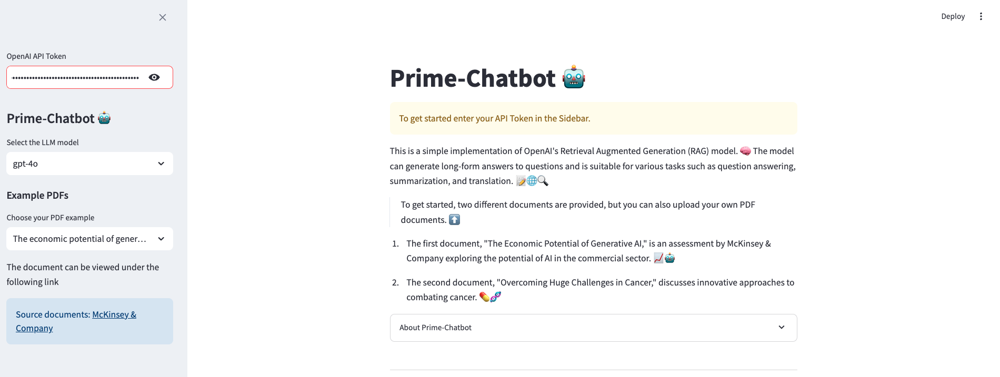
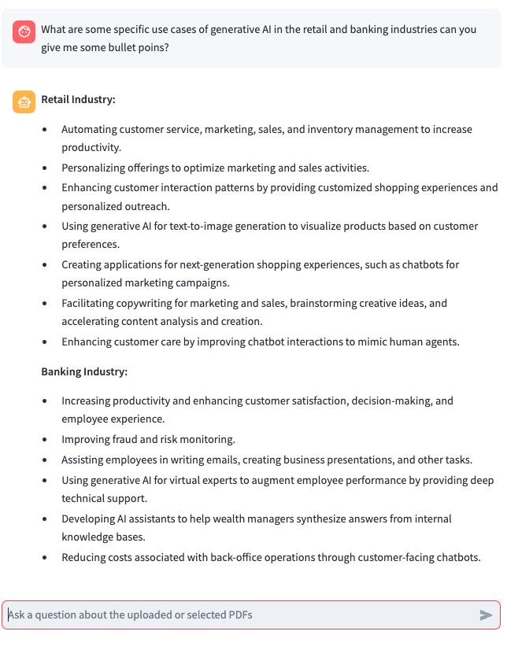

# Prime-Chatbot 🤖

Prime-Chatbot is an innovative application that enables users to integrate their own documents as a knowledge source for the Large Language Model (LLM) by using a Retrieval Augmented Generation (RAG) function. The chatbot is based on the powerful GPT-3.5-turbo and GPT-4o model and helps to make complex scientific content accessible and understandable.


<div style="margin-bottom: 20px;">
    
</div>
<div style="margin-bottom: 20px;">
    
</div>


## Functions

- **Integration of own documents:** Add your documents to provide specific knowledge content for the chatbot.

- **RAG functionality:** Use retrieval augmented generation to get precise and contextualized answers.
- **Complexity reduction:** The chatbot can summarize complicated scientific papers and translate them into simpler language.

## Documentation

### 1. The economic potential of generative AI: The next productivity frontier
Author: McKinsey & Company

This document analyzes the economic potential of generative AI and its transformative impact on various industries. It shows how generative AI can increase productivity, optimize operational processes and create innovative customer experiences. Case studies and examples illustrate the practical applications and benefits of this technology. McKinsey also emphasizes strategic actions that companies should take to realize the full potential of this technology.

### 2. genome network medicine: innovation to overcome huge challenges in cancer therapy
Author: Dimitrios H. Roukos

This paper highlights the importance of genome network medicine in cancer therapy. It shows how next-generation sequencing technologies can be used to identify new biomarkers and therapeutic targets. The paper shows how genome network medicine is helping to overcome the challenges in cancer therapy and advance clinical research. The prime chatbot supports this by simplifying complex terms and providing understandable summaries.

## Usage

### With Docker

If you are familiar with Docker, you can deploy the prime chatbot by running the following command in the terminal or in an IDE:
```
docker pull riccardodandrea/prime-chatbot:tagname
```

### By cloning the repository
Alternatively, you can clone the repository and install the required dependencies:
```
pip install -r requirements.txt
```

Make sure Ollama is running and the default models are installed:
```bash
ollama pull qwen2.5:7b
ollama pull granite-embedding:30m
```

Then ask a question about all PDFs in the default document directory:
```bash
python PrimeChatbotV2.py "What is MongoDB?"
```

Start the Streamlit app for PDF uploads and a browser-based chat:
```bash
streamlit run PrimeChatbotV2_Streamlit.py
```

Use another PDF directory or model with command-line options:
```bash
python PrimeChatbotV2.py \
  "Explain the difference between ETL and ELT." \
  --pdf-path /path/to/pdfs \
  --model qwen2.5:7b
```

The first run creates a persistent ChromaDB index. Later runs add only new or
changed chunks. Use `--skip-index` when the index is already up to date.

The Python API returns both the grounded answer and its sources:
```python
from PrimeChatbotV2_LLM import PrimeChatbot

chatbot = PrimeChatbot(file_path="Prime_Chatbot_V1/PDF_docs")
result = chatbot.index_and_ask("What is MongoDB?")

print(result.answer)
print(result.sources)
```

The legacy Streamlit application can be started with:
```
streamlit run Prime-Chatbot.py
```

### Data protection
The V2 application processes documents locally through Ollama. Uploaded PDFs
and their ChromaDB index are stored under `.prime_chatbot/` on the machine
running Streamlit and are not sent to OpenAI or another hosted model provider.
Delete that directory to remove uploaded files and generated indexes.

### Contact
If you have any questions or feedback, please do not hesitate to contact me. We look forward to your feedback and are happy to provide support!
